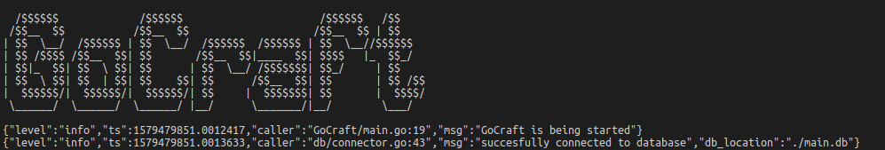
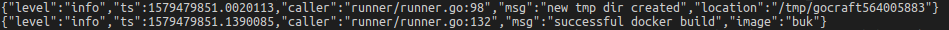
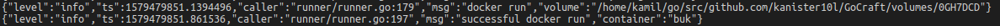
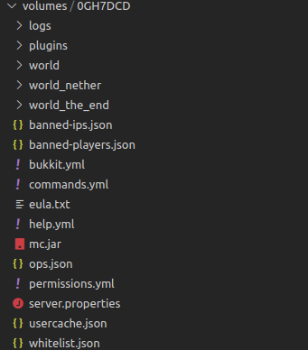
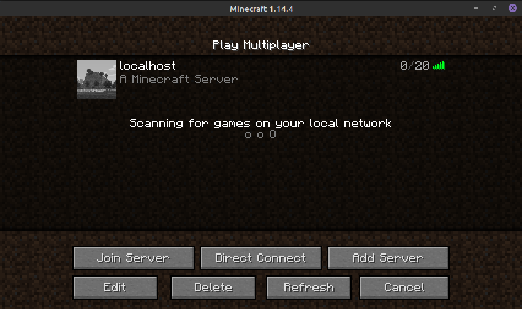
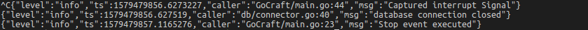

# GoCraft

## 1. Wstęp i cel pracy
Ze względu na stopień skomplikowania procesu tworzenia i uruchamiania aplikacji będącej serwerem gry Minecraft, wiele osób rezygnuje z możliwości posiadania własnego serwera tej gry.

### 1.1 Cel Pracy
Celem pracy jest opracowanie aplikacji odpowiedzialnej za automatyczne tworzenie i uruchamianie instancji serwerów gry Minecraft. Pozwoli to na szybkie, powtarzalne i łatwe tworzenie serwerów, bez konieczności ingerencji użytkownika w ten proces.

## 2. Użyte technologie
Do wykonania tego zadanie zdecydowałem się na użycie następujących technologii:

1. Golang
2. SQLite
3. Docker

Taki dobór użytych technologii pozwoli mi na szybką i optymalną implementację programu.

### 2.1 Golang
Jako główny język programowania wybrałem Golang. Motywacją do zastosowania tego języka jest jego wysoka wydajność i niewielkie zużycie zasobów. Pozwoli to na zmniejszenie wymagań sprzętowych, które w takim wypadku mogą zostać przeznaczone do wykorzystania przez serwery gry.

### 2.2 SQLite
Wybór bazy danych był bardzo ważnym elementem planowania pracy. Moim wyborem stał się SQLite ze względu na brak potrzeby uruchamiania dodatkowych aplikacji w celu uzyskania dostępu do bazy. W takim wypadku także minimalizujemy zużycie zasobów systemowych. Dodatkowo, baza ta nie musi być dostępna z maszyn będących poza uruchomioną aplikacją, więc utrudniony dostęp do bazy danych nie jest problemem w tym przypadku.

### 2.3 Docker
Jako środowisko do konteneryzacji wykorzystałem program o nazwie Docker. Pozwoli on na uruchamianie poszczególnych serwerów w odizolowanych kontenerach. W takim przypadku kolejne instancje serwerów są od siebie niezależne i można nimi bezpiecznie manipulować bez ryzyka utraty dostępności innych serwisów.

## 3. Warstwa techniczna
### 3.1 Baza danych
Baza danych składa się z czterech tabel:

1. servers
2. server_parameters
3. container_parameters
4. volumes

Tabela servers jest tabelą główną, do której odnoszą się pozostałe tabele w celu połączenia się i udostępnienia kompletu informacji opisującą instancję serwera gry

### 3.2 Aplikacja
Aplikacja składa się z pliku głównego (main.go) oraz z czterech pakietów:

1. db --> Obsługa połączniea z bazą danych.
2. eventmanager --> Zarządanie event-ami w aplikacji.
3. logger --> Zapisywanie log-ów aplikacji.
4. runner --> Uruchamianie i kontrola instancji serwerów gry.

## 4. Opis aplikacji
Cały proces działania aplikacji jest zautomatyzowany. Wszystkie logi zapisywanie przez nią są w formacie JSON

Po uruchomieniu nawiązuje ona połączenie z bazą danych.

Następnie dla każdego serwera zapisanego w bazie danych tworzy obraz kontenera.

Jeżeli obraz naszej instancji serwera jest gotowy następuje jego uruchomienie. W celu zapewnienia stałości zapisanych danych do kontenera dołączany jest wolumen zdefiniowany w tabeli volumes w bazie danych.

Po pierwszym uruchomieniu serwera w wolumenie można zaobserwować nowe pliki.

Na tym etapie serwer gry jest już dostępny i gotowy do użytkowania

W przypadku uzyskania przez aplikację przerwania, połączenie z bazą danych jest zatrzymywane, a następnie wykonywana jest procedura zatrzymania kontenerów.

## 5. Uruchomienie aplikacji
W celu uruchomienia aplikacji należy ją najpierw zbudować. W tym celu należy zaopatrzyć się w dystrybucję [GO](https://golang.org/). Po pobraniu źródła aplikacji jako archiwum zip lub poprzez:

    git clone https://github.com/Kanister10l/GoCraft.git

Następnie należy pobrać wszelkie wymagane pakiety wykonując to polecenie w głównym katalogu aplikacji:

    go get

W celu zbudowania aplikacji należy wykonać w tym samym katalogu:

    go build

Po zakończeniu tej akcji otrzymamy binarny plik wyjściowy, który jest gotową. W tym momencie aplikacja jest gotowa do uruchomienia.

## 6. Możliwości rozwoju
Dalszą możliwością rozwoju tej aplikacji jest opracowanie graficznego interfejsu użytkownika w celu definicji serwerów oraz utworzenie repozytorium gotowych kontenerów realizujących tworzenie specyficznych instancji serwerów (różnorodność wersji oraz modyfikacji dostępnych na rynku)

## 7. Wnioski
Aplikacja automatyzująca tworzenie i uruchamianie serwerów gry w znaczącym stopniu zmniejsza nakład pracy jaki jest wymagany do ich obsługi. Dodatkowo pozwala ona na zmniejszenie technicznego progu wejścia dla użytkowników, gdyż pozwala na pominięcie części trudnych zagadnień technicznych.